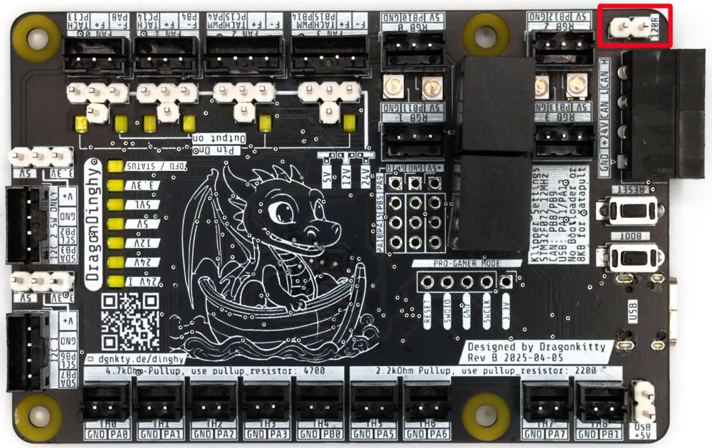
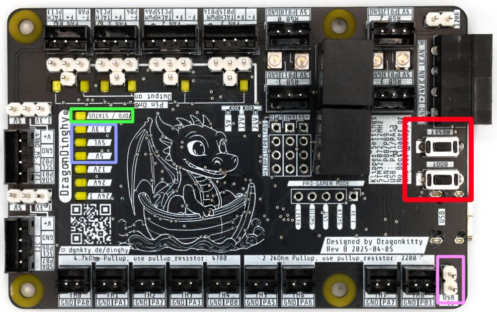
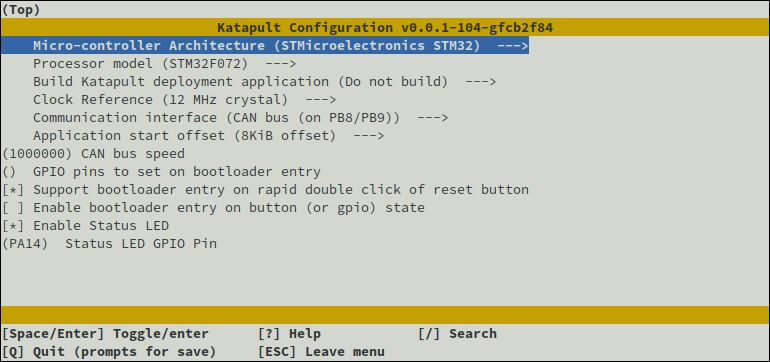
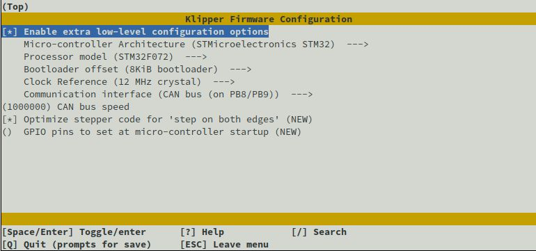

# 120 ohm Termination Resistor

The header for the 120R termination resistor is circled in red

# DFU mode

To put the DragonDinghy into DFU mode:

1. Apply Power - either via the main 24V input or via USB and the 5V USB jumper, circled in pink
2. Ensure that the 5V, 5VL and 3.3V LEDs are lit (circled in light blue)
3. Hold BOOT, tap RESET, release BOOT (circled in red)
4. DFU mode is indicated via the DFU LED (circled in green)

# Katapult Config

# Klipper Config

# Klipper as CAN Bridge

# Additional Info

Manual, schematics and troubleshooting guides can be found at [https://drachenkaetzchen.github.io/DragonDinghy/](https://drachenkaetzchen.github.io/DragonDinghy/)
