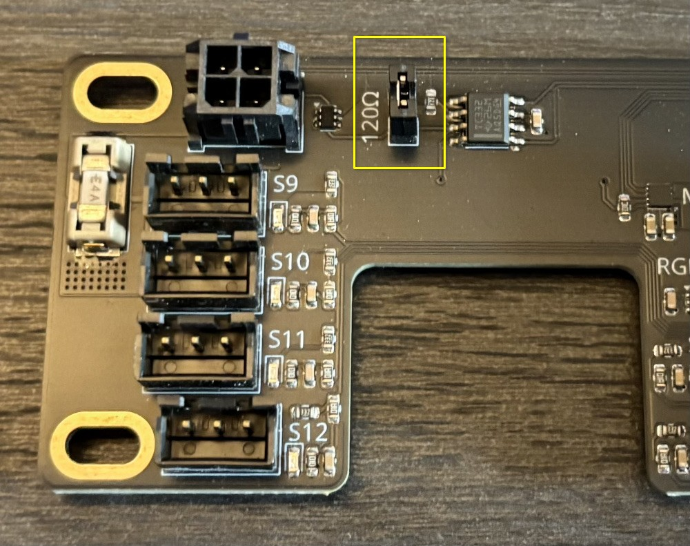
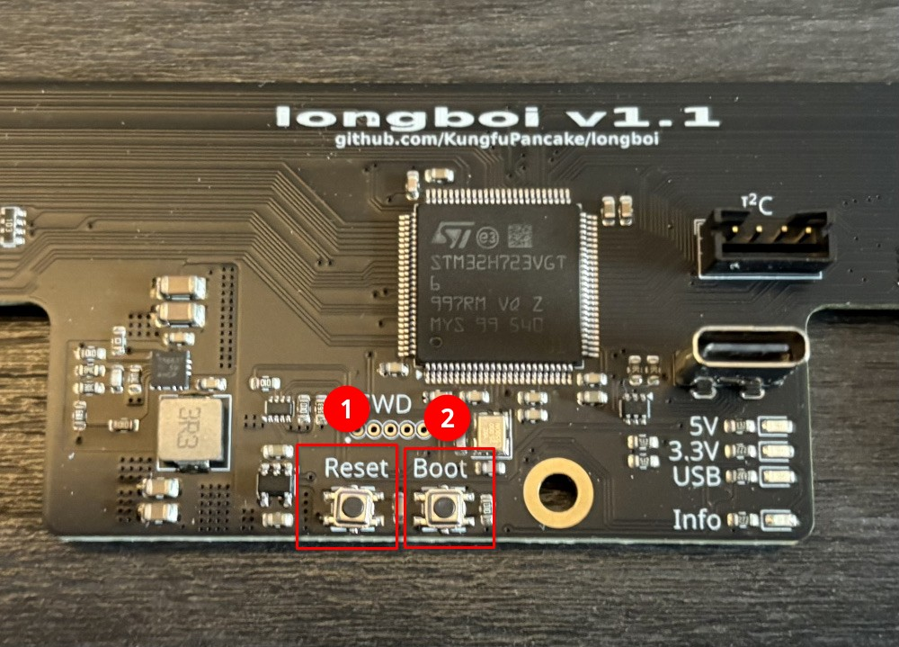
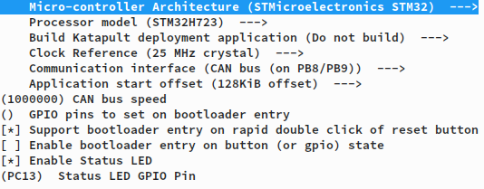
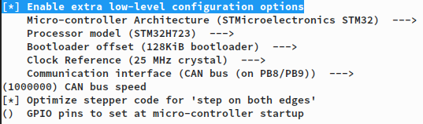

# 120 ohm Termination Resistor

The header for the 120R termination resistor is marked in yellow.

# DFU mode

The Longboi can be started in DFU mode as follows:

1. Connect a USB cable between your Computer and the Longboi
2. The board automatically switches power between the main 24V input and USB, no need to disconnect anything
3. Ensure that the 3.3V and either the USB or the 5V led are lit
4. Hold the Boot Button (2) and tap the Reset Button (1), then release the Boot Button (2)
5. The Longboi should appear as a DFU device

# Katapult Config

# Klipper Config

# Additional Info

The Longboi project is open source. You can find all design files and documentation [on Github](https://github.com/KungfuPancake/longboi).
