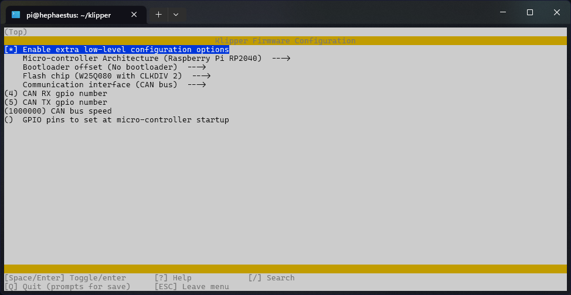

# BOOT Mode

To put the ERCF into boot mode (for initial flashing), unplug any USB and CAN cables from the ERCF, then hold the BOOT button. While continuing to hold the BOOT button plug in the USB cable from the Pi to the ERCF. Keep holding the BOOT button for a few more second, then release. 

The ERCF should now show up to an `lsusb` command as Pi RP2 Boot device:

# CanBOOT Config

# Klipper when using CanBOOT

# Klipper when **NOT** using CanBOOT

# Sample Config

A sample config file can be found at https://mellow.klipper.cn/#/board/fly_ercf/cfg

# More Info

https://mellow.klipper.cn/#/board/fly_ercf/
